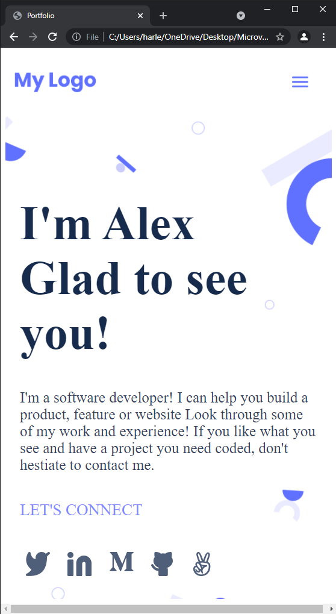

# Module-1 Portfolio page

> This is a complete version of my portfolio page project i built and completed on the second week of the first module while learning web-development at microverse.



My goal here is to Build a personal portfolio site from scratch, with focus on a mobile first design. take a peak at what i'v built [Live Demo](https://harlexkhal.github.io/Microverse-Porfolio-Website/). 😊

### Features implemented so far are:
* Integration of style linters for CSS, web linters for html & Lighthouse for page optimization testing
* Responsive mobile view and web view design using css media-queries, flex-box, and grids
* Integration of formspree for submission of contact details in contact section
* Interactive CSS animations
* Launched and deployed to github pages ([Live Demo](https://harlexkhal.github.io/Microverse-Porfolio-Website/))
* Implemented navigation menu on mobile with JavaScript events

## Built With

- Lighthouse (An open-source, automated tool for improving the quality of web pages. It has audits for performance, accessibility, progressive web apps, SEO and more).
- Webhint (A customizable linting tool that helps you improve your site's accessibility, speed, cross-browser compatibility, and more by checking your code for best practices and common errors).
- Stylelint (A mighty, modern linter that helps you avoid errors and enforce conventions in your styles).
- ESlint (A mighty, modern linter that helps you avoid errors and enforce conventions in JavaScript codes)

To get a local copy up and running follow these simple example steps.

### Prerequisites
The basic requirements for building the executable are:
* A working browser application (Google chrome, Mozilla Fire fox, Microsoft edge ...)
* VSCode or any other equivalent code editor
* Node Package Manager (For installing packages like Lighthous, webhint & stylelint used for checking for debugging bad codes before deployment)

# Getting Started

#### Cloning the project
```
git clone  https://github.com/harlexkhal/Microverse-Porfolio-Website <Your-Build-Directory>
```

## Getting packages and debuging with Stylelint
```
npm install --save-dev stylelint@13.x stylelint-scss@3.x stylelint-config-standard@21.x stylelint-csstree-validator@1.x
```
##### For validation detection using Stylelint Run
```
npx stylelint "**/*.{css,scss}"
```
##### from parent source directory

## Getting packages and debuging with ESlint
```
npm install npm install --save-dev eslint@7.x eslint-config-airbnb-base@14.x eslint-plugin-import@2.x babel-eslint@10.x
```
##### For validation detection using Stylelint Run
```
npx eslint .
```
##### from parent source directory

## Getting packages and debuging with Webhint
```
npm init -y
npm install --save-dev hint@6.x
```
##### For validation detection using Webhint Run
```
npx hint .
```
##### from parent source directory

## License

All source code files are licensed under the permissive zlib license
(http://opensource.org/licenses/Zlib) unless marked differently in a particular folder/file.

## Author
* **Alexander Oguzie-Ibeh** - [github](https://github.com/harlexkhal), [linkedin](https://www.linkedin.com/in/alexander-oguzie-ibeh-776814164), [twitter](https://twitter.com/harlexkhal)