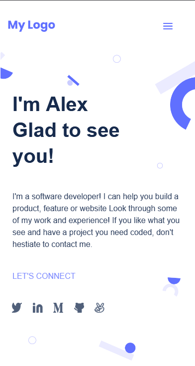

# Hello-Microverse

> This is a Mobile View Portfolio Skeleton



My goal here is to Build a personal portfolio site from scratch.

## Built With

- Lighthouse (An open-source, automated tool for improving the quality of web pages. It has audits for performance, accessibility, progressive web apps, SEO and more).
- Webhint (A customizable linting tool that helps you improve your site's accessibility, speed, cross-browser compatibility, and more by checking your code for best practices and common errors).
- Stylelint (A mighty, modern linter that helps you avoid errors and enforce conventions in your styles).

To get a local copy up and running follow these simple example steps.

### Prerequisites
The basic requirements for building the executable are:
* A working browser application (Google chrome, Mozilla Fire fox, Microsoft edge ...)
* VSCode or any other equivalent code editor
* Node Package Manager (For installing packages like Lighthous, webhint & stylelint used for checking for debugging bad codes before deployment)

# Getting Started

#### Cloning the project
```
git clone  https://github.com/harlexkhal/Microverse-Porfolio-Website <Your-Build-Directory>
```

## Getting packages and debuging with Stylelint
```
npm install --save-dev stylelint@13.x stylelint-scss@3.x stylelint-config-standard@21.x stylelint-csstree-validator@1.x
```
##### For validation detection using Stylelint Run
```
npx stylelint "**/*.{css,scss}"
```
##### from parent source directory

## Getting packages and debuging with Webhint
```
npm init -y
npm install --save-dev hint@6.x
```
##### For validation detection using Webhint Run
```
npx hint .
```
##### from parent source directory

## License

All source code files are licensed under the permissive zlib license
(http://opensource.org/licenses/Zlib) unless marked differently in a particular folder/file.

## Author
* **Alexander Oguzie-Ibeh** - [harlexkhal](https://github.com/harlexkhal)